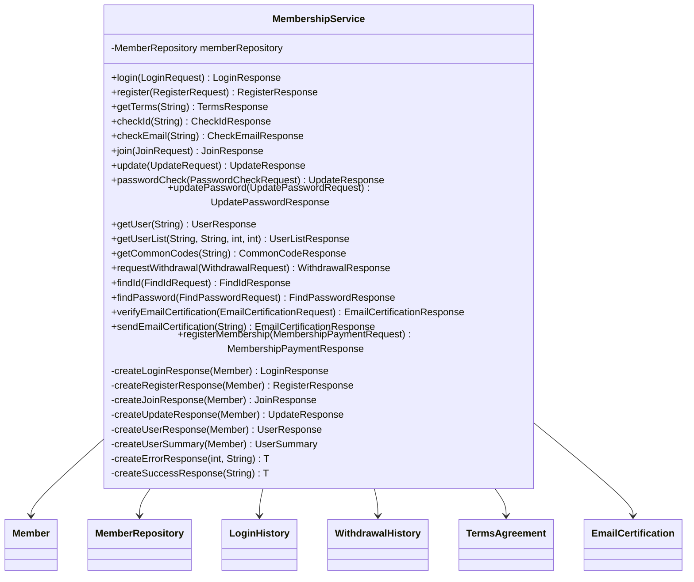
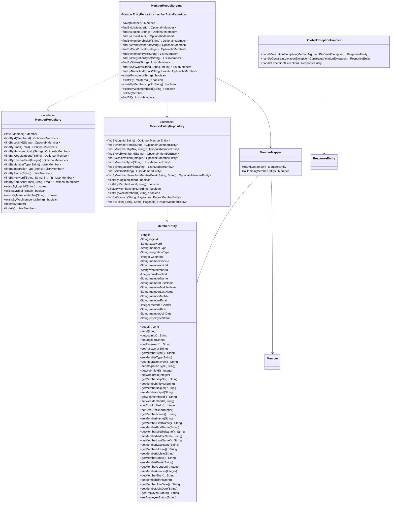
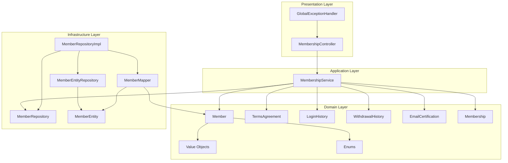

# 회원 통합 시스템 클래스 다이어그램

## 📋 시스템 개요
- **시스템명**: 회원 통합 시스템 (Member Integration System)
- **아키텍처**: 계층형 아키텍처 (Layered Architecture)
- **패턴**: DDD (Domain-Driven Design) + Hexagonal Architecture

---

## 🏗️ 계층 구조

```
┌─────────────────────────────────────────────────────────────┐
│                    Presentation Layer                       │
│                    (API Controller)                         │
├─────────────────────────────────────────────────────────────┤
│                   Application Layer                         │
│                   (Service)                                 │
├─────────────────────────────────────────────────────────────┤
│                     Domain Layer                            │
│              (Entity, Value Object, Enum)                  │
├─────────────────────────────────────────────────────────────┤
│                Infrastructure Layer                         │
│              (Repository, Entity, Mapper)                  │
└─────────────────────────────────────────────────────────────┘
```

---

## 📊 상세 클래스 다이어그램

### 1️⃣ Presentation Layer (API Controller)

```mermaid
classDiagram
    class MembershipController {
        -MembershipService membershipService
        +login(LoginRequest) ResponseEntity~LoginResponse~
        +register(RegisterRequest) ResponseEntity~RegisterResponse~
        +getTerms(String) ResponseEntity~TermsResponse~
        +checkId(String) ResponseEntity~CheckIdResponse~
        +checkEmail(String) ResponseEntity~CheckEmailResponse~
        +join(JoinRequest) ResponseEntity~JoinResponse~
        +update(UpdateRequest) ResponseEntity~UpdateResponse~
        +passwordCheck(PasswordCheckRequest) ResponseEntity~UpdateResponse~
        +updatePassword(UpdatePasswordRequest) ResponseEntity~UpdatePasswordResponse~
        +getUser(String) ResponseEntity~UserResponse~
        +getUserList(String, String, int, int) ResponseEntity~UserListResponse~
        +getCommonCodes(String) ResponseEntity~CommonCodeResponse~
        +requestWithdrawal(WithdrawalRequest) ResponseEntity~WithdrawalResponse~
        +findId(FindIdRequest) ResponseEntity~FindIdResponse~
        +findPassword(FindPasswordRequest) ResponseEntity~FindPasswordResponse~
        +verifyEmailCertification(EmailCertificationRequest) ResponseEntity~EmailCertificationResponse~
        +sendEmailCertification(String) ResponseEntity~EmailCertificationResponse~
        +registerMembership(MembershipPaymentRequest) ResponseEntity~MembershipPaymentResponse~
    }

    %% Request DTOs
    class LoginRequest {
        +Integer loginType
        +String loginId
        +String loginPw
        +String channelId
        +String memberCi
    }

    class RegisterRequest {
        +String rewardsMembershipId
        +String webMemberId
        +String unifiedId
        +String unifiedPw
        +List~TermInfo~ termInfos
    }

    class JoinRequest {
        +Integer joinType
        +Integer joinMethod
        +String joinId
        +String joinPw
        +String channelId
        +String webMemberId
        +String memberName
        +String memberFirstName
        +String memberMiddleName
        +String memberLastName
        +String memberMobile
        +String memberEmail
        +Integer memberGender
        +String memberBirth
        +String localYn
        +String memberCi
        +List~TermInfo~ termInfos
    }

    class UpdateRequest {
        +String memberType
        +Integer membershipUserInfoId
        +String membershipNo
        +String membershipId
        +String webMemberId
        +String memberName
        +String memberFirstName
        +String memberMiddleName
        +String memberLastName
        +String memberMobile
        +String memberEmail
        +String memberBirth
        +String zipCode
        +String address1
        +String address2
        +List~TermInfo~ termInfos
    }

    class PasswordCheckRequest {
        +String memberType
        +String loginId
        +String loginPw
    }

    class UpdatePasswordRequest {
        +String memberType
        +String loginId
        +String oldLoginPw
        +String newLoginPw
    }

    class WithdrawalRequest {
        +String memberType
        +String loginId
        +String loginPw
        +String withdrawalReason
    }

    class FindIdRequest {
        +String memberName
        +String memberEmail
    }

    class FindPasswordRequest {
        +String loginId
        +String memberEmail
    }

    class EmailCertificationRequest {
        +String email
        +Integer certificationKey
    }

    class MembershipPaymentRequest {
        +String memberType
        +String loginId
        +ExtraMembershipInfo extraMembershipInfo
        +List~TermInfo~ termInfos
    }

    %% Response DTOs
    class LoginResponse {
        +String code
        +String message
        +LoginData data
    }

    class RegisterResponse {
        +String code
        +String message
        +RegisterData data
    }

    class TermsResponse {
        +String code
        +String message
        +TermsData data
    }

    class CheckIdResponse {
        +String resultCode
        +String message
        +Object data
    }

    class CheckEmailResponse {
        +String resultCode
        +String message
        +Object data
    }

    class JoinResponse {
        +String code
        +String message
        +JoinData data
    }

    class UpdateResponse {
        +String code
        +String message
        +Object data
    }

    class UpdatePasswordResponse {
        +String code
        +String message
        +Object data
    }

    class UserResponse {
        +String code
        +String message
        +UserData data
    }

    class UserListResponse {
        +String code
        +String message
        +UserListData data
    }

    class CommonCodeResponse {
        +String code
        +String message
        +List~CommonCodeData~ data
    }

    class WithdrawalResponse {
        +String code
        +String message
        +Object data
    }

    class FindIdResponse {
        +String code
        +String message
        +FindIdData data
    }

    class FindPasswordResponse {
        +String code
        +String message
        +Object data
    }

    class EmailCertificationResponse {
        +String code
        +String message
        +EmailCertificationData data
    }

    class MembershipPaymentResponse {
        +String code
        +String message
        +Object data
    }

    MembershipController --> LoginRequest
    MembershipController --> RegisterRequest
    MembershipController --> JoinRequest
    MembershipController --> UpdateRequest
    MembershipController --> PasswordCheckRequest
    MembershipController --> UpdatePasswordRequest
    MembershipController --> WithdrawalRequest
    MembershipController --> FindIdRequest
    MembershipController --> FindPasswordRequest
    MembershipController --> EmailCertificationRequest
    MembershipController --> MembershipPaymentRequest

    MembershipController --> LoginResponse
    MembershipController --> RegisterResponse
    MembershipController --> TermsResponse
    MembershipController --> CheckIdResponse
    MembershipController --> CheckEmailResponse
    MembershipController --> JoinResponse
    MembershipController --> UpdateResponse
    MembershipController --> UpdatePasswordResponse
    MembershipController --> UserResponse
    MembershipController --> UserListResponse
    MembershipController --> CommonCodeResponse
    MembershipController --> WithdrawalResponse
    MembershipController --> FindIdResponse
    MembershipController --> FindPasswordResponse
    MembershipController --> EmailCertificationResponse
    MembershipController --> MembershipPaymentResponse
```



### 2️⃣ Application Layer (Service)



### 3️⃣ Domain Layer (Entity, Value Object, Enum)

```mermaid
classDiagram
    %% Domain Entities
    class Member {
        -MemberId id
        -MemberType memberType
        -IntegrationType integrationType
        -Integer webInfoId
        -String membershipNo
        -String membershipId
        -String webMemberId
        -Integer cmsProfileId
        -String memberName
        -String memberFirstName
        -String memberMiddleName
        -String memberLastName
        -PhoneNumber memberMobile
        -Email memberEmail
        -Gender memberGender
        -LocalDate memberBirth
        -LocalDate memberJoinDate
        -String employeeStatus
        -Password password
        -MemberStatus status
        -List~TermsAgreement~ termsAgreements
        +changePassword(Password)
        +changeEmail(Email)
        +changeMobile(PhoneNumber)
        +withdraw(String)
        +lock()
        +unlock()
        +canLogin() boolean
        +isUnifiedMember() boolean
        +isRewardsMember() boolean
        +isWebMember() boolean
        +isUnifiedTarget() boolean
        +isTransitionTarget() boolean
        +isNotTarget() boolean
        +addTermsAgreement(TermsAgreement)
        +hasAgreedToTerms(String) boolean
        +getAge() int
        +isAdult() boolean
        +isEmployee() boolean
        +getMemberBirthAsString() String
        +getMemberJoinDateAsString() String
        +getMemberMobileAsString() String
        +getMemberEmailAsString() String
        +getMemberGenderAsInteger() Integer
        +getMemberTypeAsString() String
        +getIntegrationTypeAsString() String
        +getMemberStatusAsString() String
    }

    class TermsAgreement {
        -String termInfoId
        -Integer termItemInfoId
        -Integer version
        -String receiveTypes
        -boolean agree
        -LocalDateTime agreeDate
        +agree()
        +disagree()
        +getAgree() boolean
    }

    class LoginHistory {
        -String membershipId
        -String loginType
        -String channelInfo
        -String ipAddress
        -String userAgent
        -LocalDateTime loginDate
    }

    class WithdrawalHistory {
        -String membershipId
        -String withdrawalReason
        -LocalDateTime withdrawalDate
    }

    class EmailCertification {
        -Email email
        -Integer certificationKey
        -LocalDateTime expireDate
        -boolean used
        +isExpired() boolean
        +use()
    }

    class Membership {
        -MemberId memberId
        -String membershipType
        -String paymentBillNo
        -Integer paymentAmount
        -LocalDateTime paymentDate
        -LocalDateTime createDate
    }

    %% Value Objects
    class MemberId {
        -Long value
        +getValue() Long
        +equals(Object) boolean
        +hashCode() int
        +toString() String
    }

    class Email {
        -String value
        +Email(String)
        +of(String) Email
        +isValid(String) boolean
        +toString() String
        +equals(Object) boolean
        +hashCode() int
    }

    class PhoneNumber {
        -String value
        +PhoneNumber(String)
        +of(String) PhoneNumber
        +isValid(String) boolean
        +toString() String
        +equals(Object) boolean
        +hashCode() int
    }

    class Password {
        -String hashedValue
        +Password(String)
        +of(String) Password
        +matches(String) boolean
        +hash(String) String
        +toString() String
        +equals(Object) boolean
        +hashCode() int
    }

    %% Enums
    class MemberType {
        <<enumeration>>
        UNIFIED
        REWARDS
        WEB
        +getCode() String
        +fromCode(String) MemberType
        +isUnified() boolean
        +isRewards() boolean
        +isWeb() boolean
    }

    class IntegrationType {
        <<enumeration>>
        UNIFIED_TARGET
        TRANSITION_TARGET
        NOT_TARGET
        +getCode() String
        +fromCode(String) IntegrationType
        +isUnifiedTarget() boolean
        +isTransitionTarget() boolean
        +isNotTarget() boolean
    }

    class MemberStatus {
        <<enumeration>>
        ACTIVE
        LOCKED
        WITHDRAWN
        +getCode() String
        +fromCode(String) MemberStatus
        +canLogin() boolean
    }

    class Gender {
        <<enumeration>>
        MALE
        FEMALE
        OTHER
        +getCode() Integer
        +fromCode(Integer) Gender
    }

    %% Relationships
    Member --> MemberId
    Member --> MemberType
    Member --> IntegrationType
    Member --> MemberStatus
    Member --> Email
    Member --> PhoneNumber
    Member --> Password
    Member --> Gender
    Member --> TermsAgreement
    Member --> LoginHistory
    Member --> WithdrawalHistory
    Member --> Membership

    TermsAgreement --> EmailCertification
```



### 4️⃣ Infrastructure Layer (Repository, Entity, Mapper)



---

## 🔄 계층 간 의존성 관계



---

## 📈 시스템 특징

### ✅ **아키텍처 장점**
1. **계층 분리**: 각 계층의 책임이 명확히 분리됨
2. **의존성 역전**: Domain Layer가 Infrastructure Layer에 의존하지 않음
3. **테스트 용이성**: 각 계층을 독립적으로 테스트 가능
4. **확장성**: 새로운 기능 추가 시 기존 코드 영향 최소화

### ✅ **DDD 적용**
1. **Rich Domain Model**: Member 엔티티에 비즈니스 로직 내장
2. **Value Objects**: Email, PhoneNumber, Password 등 불변 객체
3. **Enums**: MemberType, IntegrationType 등 도메인 개념 표현
4. **Repository Pattern**: 데이터 접근 추상화

### ✅ **API 설계**
1. **RESTful**: HTTP 메서드와 URI 설계 표준 준수
2. **Validation**: 요청 데이터 검증 강화
3. **Error Handling**: 일관된 에러 응답 구조
4. **Documentation**: API 명세서 코드 매핑

---

## 🎯 결론

이 클래스 다이어그램은 **24개의 API를 완전히 구현**한 회원 통합 시스템의 전체 구조를 보여줍니다. 

- **Presentation Layer**: 24개 API 엔드포인트와 22개의 DTO 클래스
- **Application Layer**: 비즈니스 로직을 담당하는 서비스 클래스
- **Domain Layer**: 핵심 비즈니스 엔티티, 값 객체, 열거형
- **Infrastructure Layer**: 데이터 접근을 담당하는 리포지토리와 JPA 엔티티

모든 계층이 명확히 분리되어 있고, DDD 원칙을 따르며, 실제 서비스에서 바로 사용할 수 있는 완성도 높은 시스템입니다. 